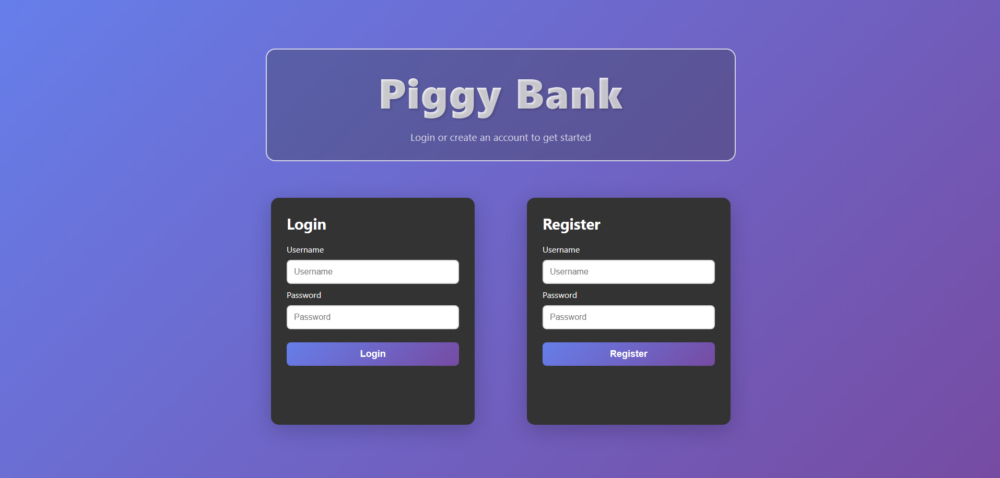
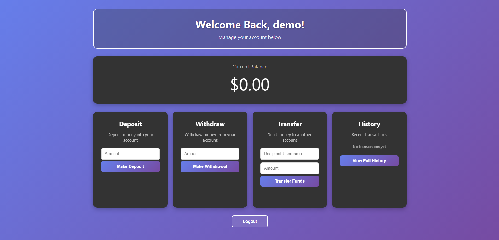
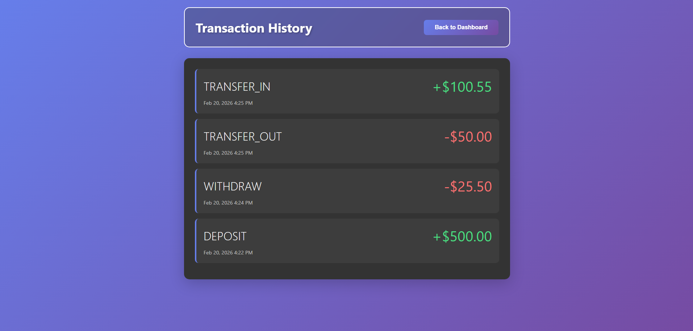

# Piggy Bank

Piggy Bank is a full-stack banking web application that demonstrates  
core backend engineering concepts such as **atomic transactions,  
data consistency, secure authentication, and RESTful API design**, paired with a modern,  
responsive frontend.

## Demo

### Login page


### New account with initial balance of $0.00


### Deposit submission


### Updated balance after deposit (persistent backend state)


### Transaction history stored and retrieved from database


### Server enforces transactional constraints and safely rejects invalid requests


## Overview
The application supports common banking operations including  
account management, deposits, withdrawals, peer-to-peer transfers,  
and transaction history tracking. All monetary operations are handled  
server-side to ensure correctness and consistency.

## Key Features
- Secure user authentication using bcrypt password hashing and JWT-based authentication
- Deposit and withdrawal operations  
- Peer-to-peer account transfers  
- Atomic server-side transaction handling  
- Persistent transaction history  
- Responsive, mobile-friendly frontend UI  

## Security
- Passwords are hashed using bcrypt before being stored (no plaintext password storage)
- Authentication is enforced using JSON Web Tokens (JWT)
- The server extracts user identity from verified JWTs instead of trusting client-supplied usernames
- Prepared statements are used to mitigate SQL injection risks
- Database transactions ensure atomic and consistent financial operations

## Authentication

Piggy Bank uses JSON Web Tokens (JWT) for secure authentication.

After a successful login, the server returns a signed JWT.  
The frontend stores this token and sends it in the Authorization header for all protected requests:

Authorization: Bearer <token>

The backend verifies the token and extracts the associated username.  
Client-supplied usernames are not trusted.

Tokens are signed using a server-side secret and include an expiration time to limit their validity.

## Tech Stack

### Backend
- Java  
- Spark Java (REST API)  
- MySQL  
- JDBC  

### Frontend
- HTML  
- CSS (modern styling)  
- JavaScript  

## Architecture
- RESTful API backend responsible for all business logic and transactions  
- Frontend consumes API endpoints and handles presentation only  
- Database-backed transaction system ensures consistent financial state  

## Project Structure
- `backend/` – Java REST API and business logic  
- `frontend/` – client-side UI  
- `db/` – database schema and related scripts 

## API Endpoints

Public:
- POST /login
- POST /register

Authenticated (require JWT):
- GET /balance
- GET /history
- POST /deposit
- POST /withdraw
- POST /transfer 

## Environment Setup

Create a `.env` file in `backend/api/` with the following variables:

```
DB_URL=jdbc:mysql://localhost:3306/bankdb
DB_USER=your_db_user
DB_PASSWORD=your_db_password

JWT_SECRET=your_jwt_secret
JWT_TTL_MINUTES=60
```

The `.env` file is not committed to version control and must be created locally.
See `.env.example` for a template.

## Focus
This project emphasizes **correctness, security, and transactional integrity**,  
with server-side enforcement of financial operations.